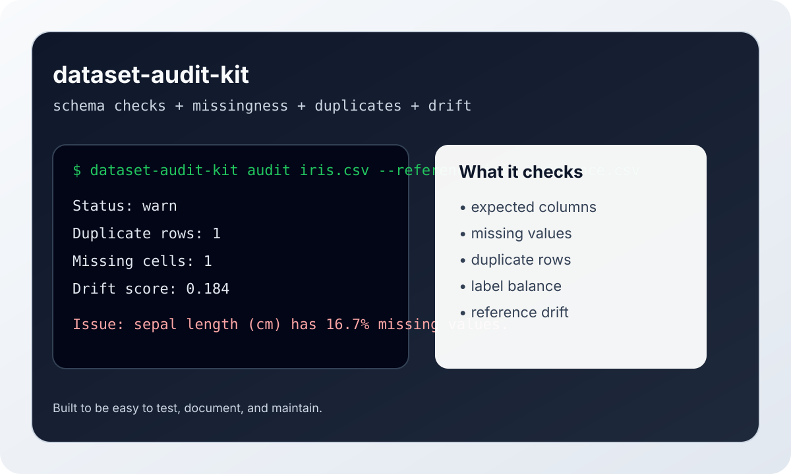

# Dataset Audit Kit

[](https://github.com/Muhtasim-Munif-Fahim/dataset-audit-kit/actions)
[](https://www.python.org/downloads/)
[](https://pypi.org/project/dataset-audit-kit/)
[](LICENSE)

`dataset-audit-kit` is a small Python library and CLI for dataset validation. It checks schema drift, missing values, duplicates, label consistency, and basic distribution shifts before a dataset reaches training or production.

The goal is to make data quality checks boring, repeatable, and easy to run in a maintainer-friendly OSS workflow.

## Problem

Many ML failures start with the data, not the model:

- a column disappears after a source change
- missing values silently spike
- duplicate rows leak into training
- labels become imbalanced
- a new dataset shifts far away from the reference baseline

This toolkit gives you a lightweight audit layer before you launch a training job or publish a dataset update.

## Features

- Schema checks against expected columns.
- Missingness summary by column.
- Duplicate-row detection.
- Label balance and label completeness checks.
- Numeric and categorical drift checks against a reference dataset.
- Configurable per-column validation rules with JSON-based rule files.
- CI-friendly `check` command that exits with code 1 on issues.
- CSV, JSONL/NDJSON, and Parquet dataset loading.
- JSON, Markdown, and HTML report output.
- CLI and notebook demo paths for documentation and review.

## Installation

```bash
pip install dataset-audit-kit

# Development install
pip install -r requirements.txt
```

## Quickstart

```python
import pandas as pd
from dataset_audit_kit import DatasetAuditor

auditor = DatasetAuditor(missing_threshold=0.05, drift_threshold=0.20)
report = auditor.audit_file(
    "train.parquet",
    reference_path="reference.jsonl",
    label_column="target",
    expected_columns=["feature_1", "feature_2", "target"],
)

print(report.to_markdown())
```

## CLI

```bash
dataset-audit-kit audit data.parquet \
  --reference reference.jsonl \
  --label-column target \
  --expected-columns feature_1,feature_2,target \
  --select-columns feature_1,feature_2,target
```

Use `--json` if you want machine-readable output for automation. In `--json`
and `--minimal` mode, notices such as "report saved to ..." go to stderr, so
stdout stays parseable: `dataset-audit-kit audit data.csv --json | jq .`.

Use `--html-out report.html` to export a shareable standalone HTML report.

### Exit codes

| Code | Meaning |
| --- | --- |
| 0 | No errors or warnings. Informational findings (a new column, an outlier note) do not fail the run. |
| 1 | At least one warning or error was reported. |
| 2 | The command could not run: bad arguments, unreadable input, or an unwritable output path. |

Supported formats are `.csv`, `.jsonl`, `.ndjson`, and `.parquet`.

### Shape

```bash
# Default output
dataset-audit-kit shape data.csv
# 1000 rows x 10 columns

# CSV output for scripting
dataset-audit-kit shape data.csv --csv
# 1000,10
```

### CI check

```bash
dataset-audit-kit check data.csv --rules rules.json
```

Exits with code `0` if all checks pass, `1` if any issues are found. Use it in CI:

```yaml
- name: Validate dataset
  run: dataset-audit-kit check data.csv --rules rules.json
```

## Per-column Validation Rules

Define stronger expectations than global thresholds with a JSON rule file:

```json
{
  "age": {
    "dtype": "numeric",
    "min_value": 0,
    "max_value": 120,
    "max_missing_ratio": 0.05
  },
  "income": {
    "dtype": "numeric",
    "min_value": 0
  },
  "category": {
    "dtype": "categorical",
    "allowed_values": ["A", "B", "C"]
  }
}
```

Use it via the CLI:

```bash
dataset-audit-kit audit data.csv --rules rules.json
```

Or in Python:

```python
from dataset_audit_kit import DatasetAuditor, ValidationRules

rules = ValidationRules.from_json("rules.json")
auditor = DatasetAuditor(rules=rules)
report = auditor.audit_file("data.csv")
```

Rules are checked per-column for:
- **Data type** — `numeric`, `categorical`, or `string`
- **Numeric bounds** — `min_value` / `max_value`
- **Allowed values** — `allowed_values` for categorical columns
- **Missing ratio** — `max_missing_ratio` (overrides the global threshold per column)

### Lint a Rules File

Check a rules contract before pointing an audit at it — bad JSON, malformed rules, uncompilable patterns, invalid date formats, and unknown dtypes each get one actionable line:

```bash
dataset-audit-kit validate-config rules.json
# OK: 3 column rule(s), 0 cross-column rule(s).
```

`validate-config` exits `0` when the file is sound, `1` when it has findings, and `2` when the file cannot be read. Pass `--profile` to lint one named profile (see below).

### Named Profiles

One rules file can hold several reusable rule sets under a top-level `profiles` object. Pick one at run time with `--profile`:

```json
{
  "profiles": {
    "strict": {
      "age": {"dtype": "numeric", "min_value": 0, "max_value": 120}
    },
    "loose": {
      "age": {"dtype": "numeric"}
    }
  }
}
```

```bash
dataset-audit-kit audit data.csv --rules rules.json --profile strict
```

`audit`, `check`, and `audit-glob` all accept `--profile`. Running against a profiles file without `--profile` fails with a list of the available names, so a CI job never audits against the wrong contract by accident.

## Demo

The repository includes a fully self-contained demo based on the public Iris dataset.

- Script: [`examples/demo.py`](examples/demo.py)
- Notebook: [`examples/demo.ipynb`](examples/demo.ipynb)



## How it compares

`dataset-audit-kit` is intentionally **lightweight** — a fast pre-flight check, not a full data platform.

| Capability | dataset-audit-kit | Pandera | Great Expectations |
| --- | --- | --- | --- |
| Install size / setup | Small, single CLI | Medium | Large, suite-oriented |
| Schema + dtype checks | Yes | Yes | Yes |
| Missingness / duplicates | Yes | Partial | Yes |
| Reference drift signals | Yes (basic) | No | Yes (richer) |
| CI `check` exit codes | Yes | Yes | Yes |
| Best for | Quick audits before training | Typed DataFrame pipelines | Enterprise data contracts |

Use this when you want a **maintainer-friendly OSS audit layer** before a training job or dataset release — not when you need a full observability platform.

## What It Reports

- Total rows and columns.
- Missing values per column.
- Duplicate rows.
- Label distribution.
- Drift score summaries for reference comparisons.
- A short issue list with severity, column, and explanation.

## Roadmap

- ~~Add HTML report export~~ ✅ v0.1.1
- ~~Add Parquet and JSONL loaders~~ ✅ v0.1.2
- ~~Add per-column validation rules~~ ✅ v0.2.0
- ~~Add CI check for auditable sample datasets~~ ✅ v0.2.0
- ~~Add columns subcommand~~ ✅ v0.3.0
- ~~Add head subcommand~~ ✅ v0.3.0
- ~~Add tail subcommand~~ ✅ v0.3.3
- ~~Add unique subcommand~~ ✅ v0.3.3
- ~~Add dtype subcommand~~ ✅ v0.3.3
- ~~Add correlate subcommand~~ ✅ v0.3.3
- ~~Add --csv flag to shape subcommand~~ ✅ v0.3.4
- ~~Add --select-columns flag to audit subcommand~~ ✅ v0.3.4

## Tests

```bash
python -m pytest -q
```

## Contributing

See [CONTRIBUTING.md](CONTRIBUTING.md) for local setup and pull request guidance.

## License

MIT - see [LICENSE](LICENSE).
